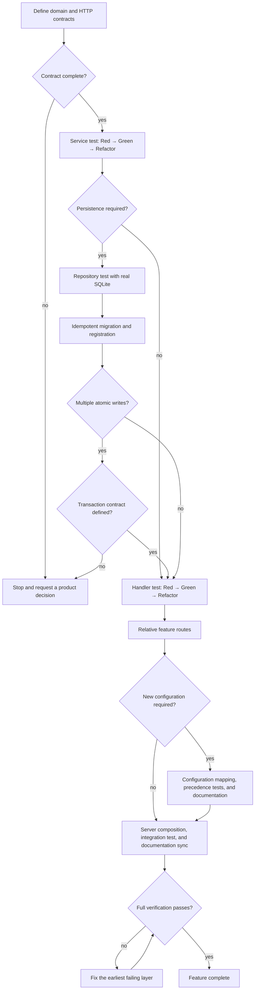

# Feature Development

This document is the canonical workflow for adding or expanding an HTTP feature
vertical slice. It defines the order of work and completion gates. Detailed
implementation policy remains in the linked canonical documents.

## Start Gate

Do not choose packages, database models, or HTTP handlers until the observable
contract is complete. Record:

- canonical domain terms and terms to avoid;
- allowed actions, rejected actions, state transitions, and invariants;
- HTTP method, path, request shape, success response, and error outcomes;
- persistence, uniqueness, ordering, and atomicity requirements;
- authentication and authorization requirements, including their absence;
- any configuration required by the feature.

Update [Domain Rules](domain.md) for product behavior and
[HTTP API Contract](http.md) for the endpoint contract. If a required decision
is missing or contradictory, stop and request that decision. Do not infer
product behavior from the example User slice.

## Development Flow



The corresponding agent execution algorithm is:

```text
P1  read AGENTS.md and the canonical documents relevant to the change
P2  define domain terms, behavior, rejections, and invariants
P3  define HTTP input, success, and error outcomes
P4  define persistence, atomicity, authentication, and configuration needs
P5  IF any required decision is missing -> stop and request the decision
P6  ELSE continue with the smallest complete use case
P7  WRITE the smallest failing Service test for one observable behavior
P8  CALL the focused Service test
P9    IF the test does not fail for the intended reason -> fix the test
P10 WRITE the minimum Service implementation
P11 CALL the focused Service test
P12   IF the test fails -> remain in the Green step
P13 refactor only while the focused test remains green
P14 IF persistence is required
P15   WRITE a failing Repository test using real SQLite
P16   WRITE the Repository contract, private record, and unexported implementation
P17   CALL the focused Repository test
P18     IF the test fails -> remain in the Green step
P19   WRITE a failing idempotent migration test
P20   WRITE the feature migration and register it in the migration runtime
P21   CALL the focused migration test
P22     IF the test fails -> remain in the Green step
P23 ELSE omit Repository, record, migration, and their interfaces
P24 IF the use case requires multiple atomic writes and policy is undefined
P25   stop and request transaction semantics
P26 WRITE a failing Handler test for the HTTP contract
P27 WRITE the private request DTO, Handler behavior, and relative route
P28 CALL the focused Handler test
P29   IF the test fails -> remain in the Green step
P30 IF new configuration is required
P31   apply the complete configuration mapping and precedence workflow
P32 ELSE leave configuration unchanged
P33 WRITE a failing integration test through the Gin router
P34 CALL the focused Server test
P35   IF the test does not fail for the intended reason -> fix the test
P36 WRITE explicit dependency construction and top-level route composition
P37 CALL the focused Server test
P38   IF the test fails -> remain in the Green step
P39 update only the canonical documents affected by the implemented behavior
P40 CALL gofmt for changed Go files
P41 CALL make verify
P42   IF a gate fails -> fix the earliest reported issue, then repeat P41
P43 finish only when code, tests, composition, and documentation agree
```

The flow deliberately stops for undefined product behavior and transaction
semantics. Authentication, authorization, concurrency, external side effects,
and partial-failure policy must also be decided before implementing a use case
that depends on them.

## Layer Order

### 1. Service

Start with the Service because it owns the use case and domain decisions without
Gin or GORM.

- Add the use case to the feature's `Service` interface.
- Implement it on the unexported `service`.
- Pass typed input and `context.Context`; do not pass transport DTOs or
  `*gin.Context`.
- Accept the feature's `Repository` interface when persistence is required.
- Inject time, randomness, identifier generation, and external calls when tests
  require deterministic control.
- Create application-owned semantic errors where their meaning becomes known,
  then use Trace v3 to add useful operation context at returning boundaries.

Test every documented allowed result and rejection through the exported
`Service` contract. Use deterministic named table cases when multiple scenarios
share one harness.

### 2. Repository and Migration

Add this layer only when the use case persists data.

- Write Repository tests against real SQLite.
- Expose one `Repository` interface containing the operations Service consumes.
- Return that contract from `NewRepository` and keep the GORM implementation as
  unexported `repository`.
- Keep GORM records private and map them to feature entities.
- Use `db.WithContext(ctx)` for every query.
- Enforce uniqueness and other concurrency-sensitive invariants with database
  constraints where applicable.
- Translate only known database meanings; wrap all other failures.
- Add an idempotent feature migration and a migration test.
- Register the migration explicitly in `internal/migration.Run`.

Do not open a database in a Handler or Service, migrate during `serve`, use GORM
hooks for domain behavior, or introduce a transaction abstraction without an
atomic multi-write contract. Follow [Database](database.md).

### 3. Handler and Routes

Add the HTTP adapter after the Service behavior is green.

- Keep request and response DTOs private to the Handler.
- Decode JSON, XML, URL-encoded forms, or multipart forms through the
  corresponding function in `internal/http/input`.
- Map the DTO to typed Service input.
- Own only the success response.
- On failure, attach a wrapped error with `c.Error`, abort, and return without
  logging or writing an error response.
- Register relative paths in the feature's `RegisterRoutes`.

Handler tests cover transport decoding, Service invocation, success status,
headers and body, and public failure behavior through the global error
middleware. Follow [HTTP API Contract](http.md).

### 4. Configuration

Skip this step unless the implemented feature requires configuration. When it
does, start by extending precedence and validation tests, then update the typed
field, canonical key, default, flag, environment name, YAML/KV path, and
[Configuration](configuration.md) in the same change.

Application packages receive typed configuration or constructed dependencies;
they never import Viper or query configuration string keys.

### 5. Composition

Composition makes the slice reachable without hiding registration.

- Write a failing router-level integration test for the complete HTTP path.
- Construct Repository, Service, and Handler dependencies in
  `internal/server.Run`.
- Add the Handler dependency to `server.New`.
- Register the feature's top-level `RouterGroup` explicitly in
  `internal/server`.
- Run the focused Server test before full verification.

Do not use package `init`, a global registry, automatic route discovery, or a
common module interface.

## Current Example Integration Points

The User creation slice demonstrates the current integration points:

| Responsibility | Evidence |
| --- | --- |
| Service contract and implementation | `internal/user/service.go:18`, `internal/user/service.go:27` |
| Handler construction and HTTP entry | `internal/user/handler.go:21`, `internal/user/handler.go:25` |
| Repository contract and implementation | `internal/user/repository.go:11`, `internal/user/repository.go:29` |
| Feature migration | `internal/user/migration.go:10` |
| Relative feature routes | `internal/user/routes.go:5` |
| Runtime dependency construction | `internal/server/server.go:46` |
| Top-level route composition | `internal/server/router.go:33` |
| Explicit migration registration | `internal/migration/migration.go:23` |

Read the nearby tests before reusing a pattern. The User domain behavior itself
is not a default for another feature.

## Definition of Done

A feature is complete only when:

- every implemented behavior and rejection exists in the domain and HTTP
  contracts;
- each included layer has a focused test through the same surface its caller
  uses;
- persistence tests use the selected real database driver;
- migrations and routes are registered explicitly when present;
- configuration sources and precedence remain aligned when changed;
- errors preserve semantic meaning, HTTP failures use the global handler, and
  returned errors are not logged by lower layers;
- changed Go files are formatted;
- `make verify` passes;
- no undefined product behavior, transaction policy, or security decision was
  silently invented.
